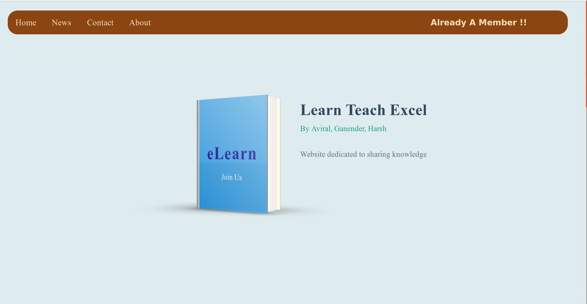
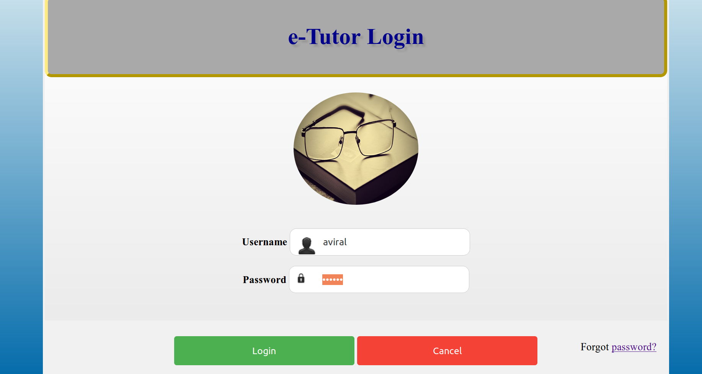
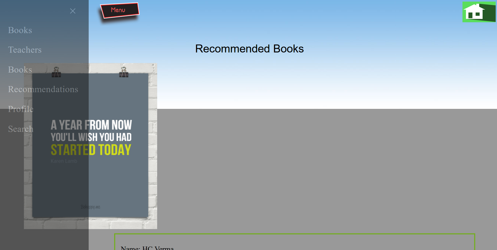

# Web Technologies Mini Project
# Project eLearn
<ul>
    <li><h2> Student Teacher Communication Portal</h2></li>
    <li><h2>Book Recommendation System</h2></li>
    <li><h2> Teachnologies Involved</h2>
        <ul>
                <li> PHP </li>
                <li> JavaScript</li>
                <li> MySQL</li>
                <li> HTML</li>
                <li> CSS</li>
                <li> PHPMailer</li>
        </ul>
    </li>
</ul>

